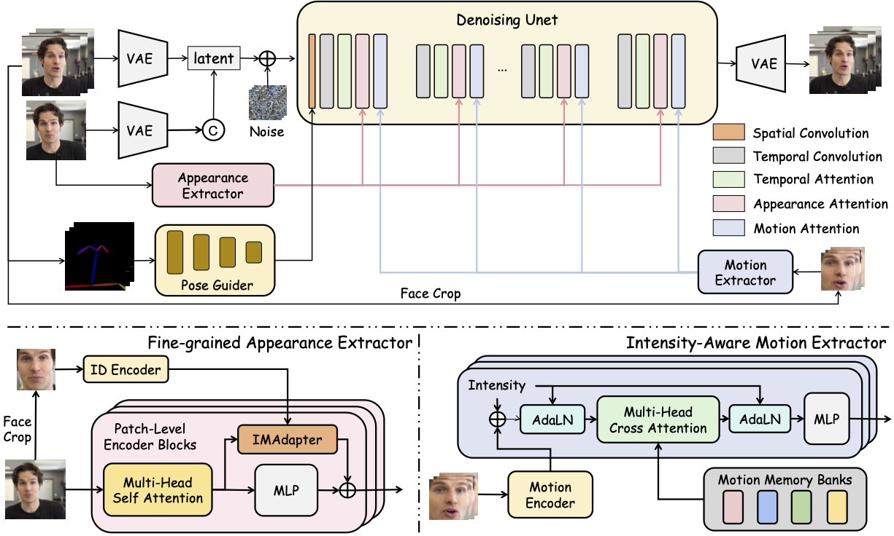

<div align="center">
<h2><font color="red"> HunyuanPortrait </font></center> <br> <center>Implicit Condition Control for Enhanced Portrait Animation</h2>

<a href='https://arxiv.org/abs/2503.18860'></a> 
<a href='https://kkakkkka.github.io/HunyuanPortrait/'></a>    [](https://github.com/kkakkkka/HunyuanPortrait) 
</div>

## Framework 


## TL;DR:
HunyuanPortrait is a diffusion-based framework for generating lifelike, temporally consistent portrait animations by decoupling identity and motion using pre-trained encoders. It encodes driving video expressions/poses into implicit control signals, injects them via attention-based adapters into a stabilized diffusion backbone, enabling detailed and style-flexible animation from a single reference image. The method outperforms existing approaches in controllability and coherence.

# 🖼 Gallery

Some results of portrait animation using HunyuanPortrait.

More results can be found on our [Project page](https://https://kkakkkka.github.io/HunyuanPortrait/).

## Cases

<table>
<tr>
<td width="25%">
  
https://github.com/user-attachments/assets/b234ab88-efd2-44dd-ae12-a160bdeab57e

</td>
<td width="25%">

https://github.com/user-attachments/assets/93631379-f3a1-4f5d-acd4-623a6287c39f

</td>
<td width="25%">

https://github.com/user-attachments/assets/95142e1c-b10f-4b88-9295-12df5090cc54

</td>
<td width="25%">

https://github.com/user-attachments/assets/bea095c7-9668-4cfd-a22d-36bf3689cd8a

</td>
</tr>
</table>

## Portrait Singing

https://github.com/user-attachments/assets/4b963f42-48b2-4190-8d8f-bbbe38f97ac6

## Portrait Acting

https://github.com/user-attachments/assets/48c8c412-7ff9-48e3-ac02-48d4c5a0633a

## Portrait Making Face

https://github.com/user-attachments/assets/bdd4c1db-ed90-4a24-a3c6-3ea0b436c227


# 📍 Note  
### 🕹 We are actively passing the internal open source review and will upload the code and weights after the review is completed.
### 💗 Thanks for your attention! If you are interested in our work, please give us a star ⭐️⭐️⭐ to let us know.
### 🚀 We will speed up the process! 

# 🎼 Citation 
If you think this project is helpful, please feel free to leave a star⭐️⭐️⭐️ and cite our paper:
```bibtex
@article{xu2025hunyuanportrait,
  title={HunyuanPortrait: Implicit Condition Control for Enhanced Portrait Animation},
  author={Xu, Zunnan and Yu, Zhentao and Zhou, Zixiang and Zhou, Jun and Jin, Xiaoyu and Hong, Fa-Ting and Ji, Xiaozhong and Zhu, Junwei and Cai, Chengfei and Tang, Shiyu and Lin, Qin and Li, Xiu and Lu, Qinglin},
  journal={arXiv preprint arXiv:2503.18860},
  year={2025}
}
``` 
